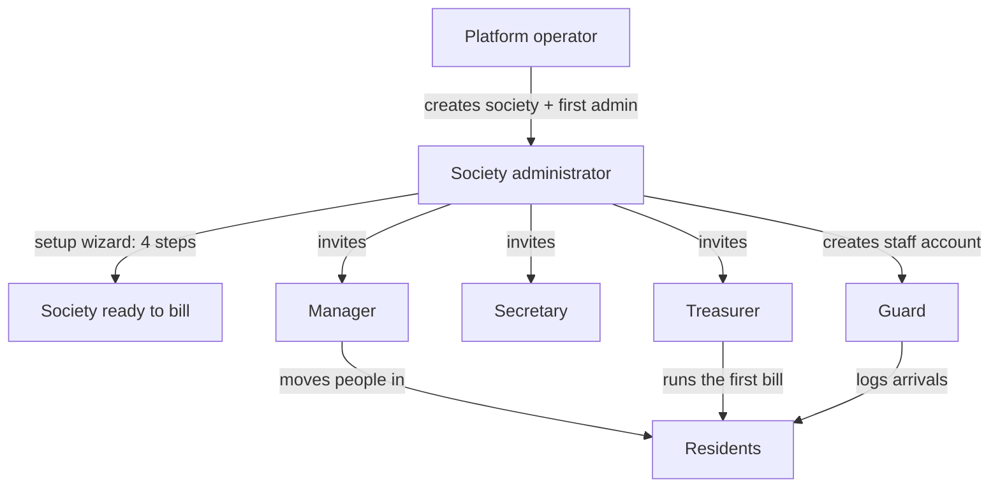
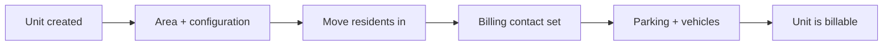
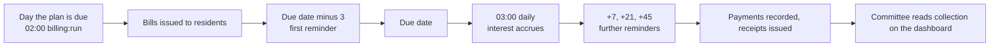

# Workflows: who does what, in what order

From an empty installation to a society that bills itself every month, and then
the ordinary working rhythm of each person who signs in.

Read [PROJECT-OVERVIEW.md](PROJECT-OVERVIEW.md) first if you want to know what
any screen named here is for. [TESTING.md](TESTING.md) covers verification.

---

## The actors

| Actor | Signs in as | Lives where |
|---|---|---|
| Platform operator | `super_admin` | Outside every society. Creates them and can open any of them |
| Society administrator | `society_admin` | Inside one society, with every permission in it |
| Chairman / Secretary | `president` / `secretary` | Governance, residents, the society's record |
| Treasurer / Accountant | `treasurer` / `accountant` | All of the money |
| Manager | `manager` | Operations, property and staff; records money but does not approve it |
| Resident | `owner` / `tenant` | Their own flat, bills, tickets and bookings |
| Guard | `security_guard` | The gate console only |



---

## Stage 0: a fresh installation

There is nobody to sign in as yet, so the first society is created from the
command line.

```bash
php artisan society:create \
    --name="Sunrise Enclave" \
    --type=gated_community \
    --city=Pune \
    --admin-name="Priya Kulkarni" \
    --admin-email=priya@sunrise.test \
    --payment-mode=both \
    --super-admin
```

Run it with no options and it prompts for each. `--super-admin` also makes that
administrator a platform operator, which is how you bootstrap access to the
console. The command prints a generated password when you do not supply one.

To promote an existing account later:

```bash
php artisan user:super-admin you@example.com
php artisan user:super-admin you@example.com --revoke
```

On a demo or evaluation installation, `php artisan db:seed` instead builds two
fully populated societies with five months of billing history. Sign in as
`super@sankul.test` / `password`.

---

## Stage 1: the platform operator creates a society

**Who:** platform operator. **Where:** Platform → All societies.

1. Open `/platform/societies`. This lists every community on the installation
   with its unit count and status.
2. **Create a society** and fill in two groups of fields:

   | Society | First administrator |
   |---|---|
   | Name | Name |
   | Type (apartment, villa project, gated community, township, commercial complex, and eleven more) | Email |
   | City, state | Phone (optional) |
   | Area unit: sq.ft., sq.m. or sq.yd. | Password (optional; generated if left blank) |
   | Financial year start month (April by default) | |
   | Payment mode: offline, online, or both | |

   An account that already exists with that email is reused rather than
   duplicated, so one person can administer several societies.

3. Saving provisions the society in full, with no further action. It gets:

   - Its own copy of all thirteen roles, each with its default permission set
   - A chart of accounts
   - Eight charge heads: Maintenance, Sinking Fund, Water, Parking, Corpus,
     Festival Fund, Late Payment Interest, Amenity Booking
   - A late fee rule
   - Helpdesk categories with response and resolution SLA targets
   - A reminder ladder at `-3, 0, 7, 21, 45` days around the due date
   - An open financial year
   - Default site features for the site plan
   - Default preferences

4. The society's status is **onboarding** until its administrator finishes the
   wizard.

5. **Open** switches the operator into the society to work inside it. A society
   still onboarding opens its setup wizard instead of its dashboard.

> A platform operator is not a member of the societies they administer. They can
> reach any of them, but their role is held outside all of them, which is why
> this console is on its own route.

---

## Stage 2: the society administrator sets the society up

**Who:** society administrator (or anyone with `society.settings`).
**Where:** `/onboarding`, which they land on automatically while the society is
still onboarding.

Four steps. Everything else has a sensible default and can wait.

### Step 1: identity

Community type, area unit, financial year start month, city. These were set at
creation; this is the chance to correct them before anything depends on them.

The type decides the default unit type used in the next step: a villa project
creates villas, a plotted development creates plots, a commercial complex
creates offices.

### Step 2: structure

Two plain text fields, because a form per unit is unusable for 72 flats.

| Field | Example | Result |
|---|---|---|
| Buildings or wings | `A, B, C` | Three blocks |
| Unit numbers | `101-104, 201-204, 301` | Those nine numbers, created in every block named above |

A range expands (`101-104` becomes 101, 102, 103, 104), up to 500 at a time. A
chunk that is not a range is taken literally, so `G-01, G-02` works. With no
buildings named, units sit directly under the society.

Nothing is overwritten: re-running the step adds what is missing and leaves
what exists.

### Step 3: charges

The step asks one question in the words a committee uses: **how much is
maintenance?**

| Answer | Then it asks for |
|---|---|
| The same for every home | One amount |
| Different for each building | An amount per building |
| Different by size of home | An amount per 2BHK, 3BHK and so on |
| Different by building and size | A grid, one box per building and size |
| By area | A rate per square foot |

Then two optional things:

- **Paying the year in one go.** Tick it and type what a year costs when paid
  together. The screen shows the saving and the percentage it works out to.
  Stored as a percentage; editable later per building.
- **The extras.** Water, sinking fund, parking and the rest, only if the
  society takes them. Most take one amount and nothing else.

Finally the cycle (monthly, bi-monthly, quarterly, half-yearly, yearly) and how
many days residents get to pay.

Saving this step writes the rates, creates a billing plan called **Standard
maintenance** with the heads that have an amount against them, and sets it to
generate and issue automatically.

### Step 4: collection

Offline, online, or both, and whether an offline payment needs approving before
it settles a bill.

Choosing online or both does **not** switch online collection on by itself. A
society collects offline until a gateway is configured and verified under
Settings, so a resident is never shown a pay button that cannot work.

Finishing marks the society active.

---

## Stage 3: configuring beyond the wizard

Still the administrator, now in the running app. None of this is required to
raise the first bill; all of it is worth doing before the second.

### 3.1 Society settings  `/settings`

- **Profile**: registration number, GSTIN, full address, contact email and
  phone. These print on invoices and receipts.
- **Payment gateway**: provider, test or live, key id, key secret, webhook
  secret. Stored encrypted, per society, so each collects into its own bank
  account. Use test keys until a real payment has gone through. Online
  collection switches on when the credentials verify against the provider.
- **Preferences**:

  | Preference | Default | What it changes |
  |---|---|---|
  | Offline payment needs approving | On | A recorded payment only settles a bill once approved |
  | Residents see each other's phone numbers | Off | The directory |
  | Helpdesk auto-escalates | On | A ticket past its SLA escalates on its own |
  | Escalate after | 24 hours | How long before it does |
  | Walk-in visitor needs resident approval | On | The guard's screen asks the resident |

### 3.2 Reminders and the wording  `/settings/communication`

The ladder starts at `-3, 0, 7, 21, 45` days around the due date. Add steps,
switch them off or delete them. Reminders go out once a day, on weekdays, and
only on the days named.

Eight messages carry templates you can rewrite in your own words, with a
preview against sample data: maintenance reminder, payment receipt, new bill,
notice published, meeting notice, minutes circulated, complaint update, visitor
at the gate. Leave one alone and it uses the packaged wording. Reverting is a
delete.

> A resident reminded every morning stops reading reminders. Fewer, firmer
> steps work better.

### 3.3 Roles and access  `/settings/roles`

Adjust what each role can do in this society. Keep at least two people with
full administration: one is a single point of failure.

### 3.4 The people who run it

Invite the treasurer, secretary and manager and give them their roles. A guard
gets a staff record under `/staff` and an account with the `security_guard`
role; they sign in straight to the gate console and see nothing else.

### 3.5 Rates, revisited  `/charge-heads`

The wizard asked once. Rates get revised at every general body meeting, so
**Set rates** on a head asks the same question again, in the same words, in the
place a committee comes back to.

### 3.6 Flats settled individually  `/units/{unit}`

Open the flat, find **What this home pays**, and set a different amount for
that one home or leave it out of a charge entirely. Record why. The reason and
the name of whoever agreed it stay on the card for the next committee. "Use the
shared amount" puts it back on its building's figure.

### 3.7 The prepayment deal, per building  `/billing-plans`

**Offer a prepayment discount** on the plan. Type what a year costs paid
together; each building gets its own box, prefilled with what that building
normally pays for a year. Blank means it takes the society's offer. Zero means
it was deliberately promised nothing.

### 3.8 Opening balances

**Before the first bill run.** Record what each unit already owed when the
system came in. Afterwards the arrears figure on every bill will be wrong, and
correcting it later means credit notes.

---

## Stage 4: loading the property

**Who:** administrator, secretary or manager.

1. **Units** `/units`. The wizard created them with numbers only. Add carpet
   and built-up area (which per-square-foot charges are worked out from),
   configuration (2BHK, 3BHK, which size-based rates key on), floor, and mark
   anything that should not be billed, such as the society office, as not
   billable.
2. **Residents.** Move people in from the unit itself, not from a resident
   list, which is what keeps each unit's history straight. For each: name,
   email (an existing account is reused so their history follows them), phone,
   relation (owner, co-owner, tenant, family member, occupant), the date they
   moved in, and whether bills go to them.
   - For a tenant, also the agreement end date, so the committee is warned 60
     days before it runs out, and the rent if you want it on file.
   - Every unit needs a billing contact. The system will not leave one without.
3. **Parking** `/parking`. Allot slots to units and record vehicles against
   them. Per-vehicle charges count what is recorded here.
4. **Site plan** `/site-plan`. Drag the buildings into where they actually
   stand. Until somebody does, they sit on an automatic grid.



---

## Stage 5: the first bill run

**Who:** treasurer. **Where:** `/billing-plans`.

1. Check the plan: the right heads, the right cycle, the right due days.
2. Press **Run now**. Bills are raised for every billable unit, and issued
   straight away if the plan issues automatically.
3. Read the result. It says how many were created, how many were skipped and
   the total.
4. Check `/invoices`. Open one and read it line by line against what the
   committee decided.
5. If something is wrong, fix the rate and re-run: a plan will not bill the
   same unit for the same period twice, so a re-run only picks up what was
   missed. A bill already issued keeps the rate it was raised at. That is why
   an old receipt still adds up, and why a correction is a credit note rather
   than an edit.

From then on `billing:run` raises them at 02:00 on the day they come due,
without anybody pressing anything.

> Dry run first if you want to see it without writing:
> `php artisan billing:run --dry`

---

## Stage 6: money coming in

### Offline, which is most of it

1. A resident pays by cash, cheque, UPI or bank transfer.
2. The treasurer or manager records it at `/payments`: the unit, the amount,
   how it arrived, the date and the reference number.
3. Allocation is automatic, oldest unpaid bill first. More than was owed is
   kept as credit against that unit rather than refused.
4. If the society requires approval, someone with `payment.approve` approves
   it, and only then does it settle the bill.
5. A numbered receipt is issued and sent to the resident. The PDF carries a QR
   code anyone can scan at `/verify/receipt/{uuid}` to confirm it is genuine,
   without signing in.

### Online

Available once a gateway is configured and verified. The resident pays from the
bill; the gateway is re-queried for the real amount rather than trusting what
the browser posts back; the payment, the allocation and the receipt follow the
same path as an offline one.

### When nobody pays

`billing:remind` runs at 10:00 on weekdays and sends on the days the ladder
names, in the society's own wording, recording every send. Overdue bills accrue
interest at 03:00 daily under the late fee rule, one period at a time, with a
key per invoice that makes a double run impossible.

The defaulter list on the dashboard and under Reports is the shortlist to
chase. Each row opens that unit and everything it owes.

---

## Stage 7: the working week

### The manager

| Daily | Weekly |
|---|---|
| Helpdesk: triage new tickets, assign them, watch anything marked urgent or past its SLA | Work orders: what is open, what is overdue |
| Amenity bookings waiting on a decision | Assets: anything with an inspection or AMC coming up |
| Visitors inside at the end of the day who were never checked out | Staff attendance |
| Expenses incurred today, recorded with the bill attached | |

### The treasurer

| Daily | Monthly |
|---|---|
| Record payments that arrived | Check the bill run went out and read a sample |
| Approve what needs approving | Approve expenses |
| | Export the defaulter list and chase it |
| | Reconcile cash and bank against the ledger |

### The secretary

Notices when there is something to say. Meetings as they come up: create it
with its agenda, send the notice (the bye-laws usually set a minimum number of
days, and the record of the notice being sent is the proof it was given), mark
attendance on the day, record the minutes and the resolutions, and circulate
them. Polls between meetings where the bye-laws allow it.

### The guard

Signs in to `/gate` and nothing else. For each arrival: what kind, then the
company or the name, then the flat. Three taps, nothing typed. The resident is
told straight away. Waiting, Expected and Inside are the three lists, each with
one-tap actions. A delivery left at the desk with no flat is logged without
troubling anybody. A gate pass is checked by its code before anything leaves.

### The resident

Signs in and sees their own position: what they owe, what is overdue, their
open tickets, the latest notices, upcoming meetings, open polls, their bookings
and visitors expected for them. They can raise a complaint, book an amenity,
vote in a poll, pre-approve a visitor, request a gate pass, read a notice, and
download any receipt they have been issued.

They cannot see other flats' money, the unit records, or who used to live
anywhere.

---

## Stage 8: the month and the year

### Every month



### Every quarter or half year

Committee meeting: agenda, notice, attendance, minutes, resolutions. Review the
defaulter list and decide what to do about the long tail. Check AMCs and
statutory inspections that are coming up.

### Every year

1. **Before the AGM**: export the trial balance, income and expenditure, and
   balance sheet for the financial year. Upload the audited accounts to
   Documents.
2. **The AGM**: create the meeting, send the notice with the days the bye-laws
   require, mark attendance, record quorum, minute every resolution, circulate
   the minutes.
3. **Rate revisions decided there**: apply them under Charge heads, and under
   Billing plans if the prepayment deal changed. The new rates apply to bills
   raised from then on and leave issued bills alone.
4. **The new financial year** opens; receipt and invoice numbering starts a
   fresh unbroken series.

### When the committee changes

1. The outgoing administrator gives the incoming one their role under Roles and
   access **before** standing down.
2. Keep at least two people with full administration at all times.
3. Nothing is deleted in a handover. Past residents, past committees, past
   receipts and the audit log are the society's record, which is exactly what
   the new committee needs when somebody disputes something from two years ago.

---

## Quick reference: who can do what

| Task | Permission | Who holds it by default |
|---|---|---|
| Create a society | platform role | Platform operator |
| Run the setup wizard | `society.settings` | Admin, chairman |
| Change rates | `billing.manage` | Admin, chairman, treasurer, accountant |
| Set one home's amount | `billing.manage` | Admin, chairman, treasurer, accountant |
| Raise bills | `invoice.generate` | Admin, chairman, treasurer, accountant |
| Record a payment | `payment.record` | Admin, chairman, treasurer, accountant, manager |
| Approve a payment | `payment.approve` | Admin, chairman, treasurer, accountant |
| Approve an expense | `expense.approve` | Admin, chairman, treasurer, accountant |
| Move a resident in or out | `resident.manage` | Admin, chairman, secretary, manager |
| See past residents and votes | `history.view` | Admin, chairman, secretary |
| Run a meeting | `meeting.manage` | Admin, chairman, secretary |
| Publish a notice | `notice.manage` | Admin, chairman, secretary, manager |
| Operate the gate | `gate.operate` | Admin, chairman, guard |
| Change roles | `society.manage` | Admin, chairman |
| Read the audit log | `audit.view` | Admin, chairman, secretary |
